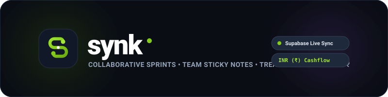
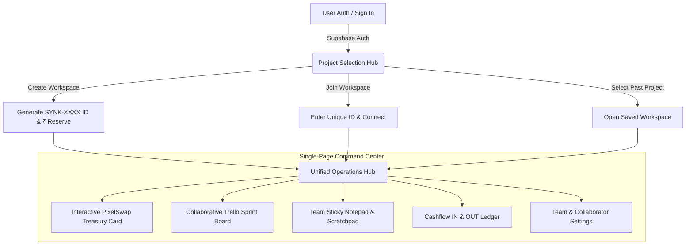

<div align="center">



<br />

# **synk**
### *The Next-Gen Unified Operations Platform for Agile Teams & Creator Collectives*

<p align="center">
  <a href="https://nextjs.org/"></a>
  <a href="https://www.typescriptlang.org/"></a>
  <a href="https://tailwindcss.com/"></a>
  <a href="https://supabase.com/"></a>
  <a href="https://reactbits.dev/"></a>
  <a href="https://github.com/Rushiiii505/synk"></a>
</p>

<p align="center">
  <a href="#-core-pillars">Features</a> •
  <a href="#-architecture--workflow">Architecture</a> •
  <a href="#-tech-stack">Tech Stack</a> •
  <a href="#-getting-started">Getting Started</a> •
  <a href="#-mobile-experience">Mobile</a> •
  <a href="#-license">License</a>
</p>

<br />


<p align="center">
  <strong>synk</strong> is a high-velocity, single-page operations hub designed for startup collectives, creator studios, and agile product teams. It synchronizes sprint Kanban cards, multi-color sticky notes, and real-time treasury cashflows in Indian Rupees (₹) into one unified command center.
</p>

---

</div>

## 🌟 Core Pillars

```
 ┌────────────────────────────────────────────────────────────────────────┐
 │                              synk HUB                                  │
 ├───────────────────┬────────────────────┬───────────────────────────────┤
 │  📋 Agile Trello  │  📝 Sticky Notes   │  💳 Treasury Cashflow (₹)     │
 │  • Sprint columns │  • Color memos     │  • Money IN vs Money OUT      │
 │  • ₹ Budget tags  │  • Image diagrams  │  • Invoice receipt preview    │
 │  • Subtasks       │  • Live scratchpad │  • Team cost-split calculator │
 └───────────────────┴────────────────────┴───────────────────────────────┘
```

### 📋 1. Collaborative Agile Sprint Board (Trello-Style)
- **Fluid Drag-and-Drop Columns**: *Ideas & Backlog*, *To Do*, *In Progress*, *Review*, and *Done*.
- **Budget-Tagged Sprint Cards in ₹**: Assign financial budgets directly to tasks for sprint cost tracking.
- **Subtasks & Image Attachments**: Checklists, cover image uploads, priority tags, and color label bars.
- **Mobile Touch Snap-Swipe**: Native `touch-pan-x snap-x` scrolling on iOS and Android phones.

### 📝 2. Team Sticky Notepad & Live Shared Scratchpad
- **Color-Coded Sticky Memos**: Mint, Yellow, Lavender, Sky Blue, and Peach notes with 1-click posting.
- **Pinning & Diagrams**: Pin critical memos to the top and attach image diagrams.
- **Live Synchronized Scratchpad**: Shared Markdown scratchpad with 1-click clipboard copying.

### 💳 3. Treasury Cashflow Hub (Money IN vs Money OUT in ₹)
- **Real-Time Cashflow Ledger**: Log client retainers and funding (+ IN) and software subscriptions and contractor payouts (- OUT).
- **Invoice & Receipt Viewer**: Attach and inspect payment receipts directly in the ledger.
- **Team Cost-Splitting Calculator**: Calculate and track expense splits among collaborators with live settlement tracking.
- **Dynamic Spending vs Cap Chart**: Interactive SVG dual-bar graph comparing monthly outflow against target treasury caps.

### ⚡ 4. React Bits Interactive Component Integrations
- **`<PixelSwap />` Treasury Engine**: Interactive pixel pop animation toggling between the live Lime Treasury Reserve Balance and real-time operational velocity metrics.
- **`<ScrollReveal />` Manifesto Deck**: GSAP-powered word-by-word blur and rotation scrub for team mission statements.

### 👤 5. Executive Gradient Monogram Avatar System
- Deterministic, high-contrast 2-letter uppercase monogram badges with live presence status indicators (*online*, *focusing*, *meeting*, *away*, *offline*).

### 🔐 6. Supabase Authentication & Multi-Project Memory
- Clean light theme authentication (Sign Up / Sign In).
- Auto-generates shareable Unique Project IDs (e.g. `SYNK-8421`).
- Remembers past created and joined workspaces per user account with 1-click workspace switching.

---

## 🏗️ Architecture & Workflow



---

## 🛠️ Tech Stack

| Layer | Technology | Description |
|---|---|---|
| **Framework** | [Next.js 16](https://nextjs.org/) | App Router, Server Components & Turbopack |
| **Language** | [TypeScript 5](https://www.typescriptlang.org/) | End-to-end type safety |
| **Styling** | [Tailwind CSS 4](https://tailwindcss.com/) | Custom design tokens & modern micro-interactions |
| **Animations** | [GSAP](https://greensock.com/gsap/) + [React Bits](https://reactbits.dev/) | PixelSwap & ScrollReveal animation components |
| **Backend & Auth** | [Supabase](https://supabase.com/) | Email & Password Auth, PostgreSQL database sync |
| **Icons** | [Lucide React](https://lucide.dev/) | Clean, scalable vector iconography |

---

## 🚀 Getting Started

### 1. Clone the Repository
```bash
git clone https://github.com/Rushiiii505/synk.git
cd synk
```

### 2. Install Dependencies
```bash
npm install
```

### 3. Configure Environment Variables
Create a `.env.local` file in the root directory:
```env
NEXT_PUBLIC_SUPABASE_URL=https://your-project.supabase.co
NEXT_PUBLIC_SUPABASE_PUBLISHABLE_KEY=your-supabase-publishable-key
```

### 4. Run Development Server
```bash
npm run dev
```
Open [http://localhost:3000](http://localhost:3000) (or `http://localhost:3001`) in your browser.

### 5. Build for Production
```bash
npm run build
npm run start
```

---

## 📱 Mobile Experience

`synk` is built mobile-first with:
- `touch-pan-x snap-x snap-mandatory` horizontal kanban swipe.
- Responsive top operations header with quick action triggers.
- Mobile-friendly cashflow tables and bottom-sheet dialogs.

---

## 📄 License

Distributed under the MIT License. See `LICENSE` for more information.

<div align="center">
  <br />
  
  <br />
  <sub>Designed & Developed with ⚡ for high-velocity teams.</sub>
</div>
